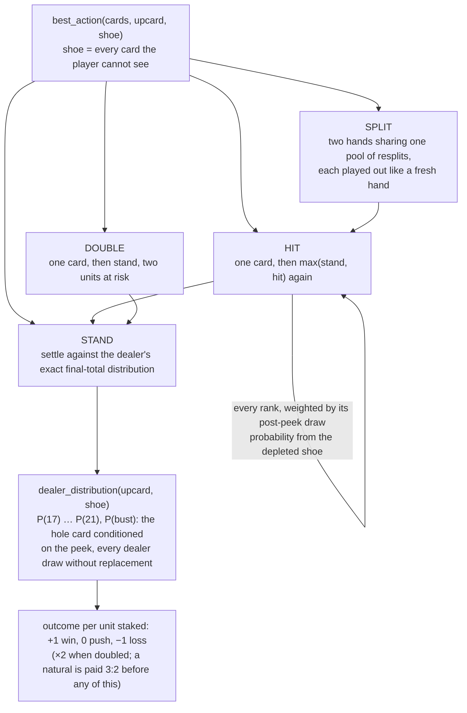

# exact-blackjack-solver

[](https://github.com/T92T1914/exact-blackjack-solver/actions/workflows/ci.yml)
[](.github/workflows/ci.yml)
[](LICENSE)

A composition-dependent blackjack solver with exact enumeration for hit,
stand, and double against the remaining shoe. **Split valuation is approximate:**
it values the split hands independently and uses a greedy shared resplit budget.
Those limits apply to derived strategy and whole-game estimates too; see
[the model details](#how-it-works). The answer is deterministic enumeration,
not a Monte Carlo sample or a trained model.

**Hard 16 vs 10: hit, by a margin of +0.0063 — a coin flip the solver refuses
to dress up as a rule. Soft 18 vs 3: double, at an EV of +0.1793. The exact
enumeration is cross-checked by an independent Monte Carlo harness, inside a
suite with 865 passing checks on the verified local run.**

[Run it](#run-it) | [A worked decision](#a-worked-decision) | [How it works](#how-it-works) | [The derived chart](#the-chart-the-solver-derives) | [What this does not prove](#what-this-does-not-prove)

Extracted and generalized from a larger private project: a read-only advisory
overlay I built for a friends' fake-currency blackjack game, which advised one
decision per hand and scored how closely the player followed it. This repo is
the algorithmic core of that system — the solver, its dealer model, and its
verification harness — with a self-contained CLI and test suite, no network and
no game attached, so every number here is runnable on any machine with Python
3.11+.

Two things this is **not**, stated up front because both would be easy to
assume and both are wrong:

- **There is no machine learning here.** No training set, no weights, no
  fitting. The strategy comes from exact enumeration — a recursive solver that
  walks every reachable continuation of a hand against every dealer hole card,
  weighted by the exact composition of the remaining shoe and memoised on an
  immutable shoe tuple.
- **It is not game theory.** The dealer does not respond to anything; it follows
  a published rule. There is no opponent model, no equilibrium, nothing
  adversarial. It is a single-agent finite-horizon **Markov decision process
  solved by dynamic programming, with the split approximations described below.**

## Run it

```
pip install -e .                     # use: installs the `bj-advise` command; numpy is the one dependency
pip install -e ".[dev]"              # tests: the same plus pytest and ruff
python demo.py 8,8 T                 # one decision, ranked, with EVs (`bj-advise 8,8 T` once installed)
python demo.py --table               # the chart below, derived by the solver (about a minute)
python -m pytest -q                  # the suite, ~3 minutes
```

Python 3.11+ and `numpy` (used only by the Monte Carlo harness). CI lints and
runs the suite on Python 3.11, 3.12 and 3.13. The two hands in the bold line
above are `bj-advise T,6 T` and `bj-advise A,7 3`; `--decks`, `--h17` and
`--no-das` change the table (`bj-advise 6,5 A --h17` is a dealer-hits-soft-17
table); `BJ_SLOW=1 python -m pytest -q` adds the multi-million-hand
statistical runs; `ruff check .` is what CI lints with, installing from
`requirements.txt` and `requirements-dev.txt`.

## A worked decision

`python demo.py 8,8 T` — the famous split-eights hand, against a dealer ten:

```
Hand: 8 8  (16)  vs dealer T

  SPLIT    EV -0.4749  <- recommended
  HIT      EV -0.5354
  STAND    EV -0.5369
  DOUBLE   EV -1.0707

Recommended: SPLIT  (margin +0.0605 over the next-best action)

Player EV per hand under basic strategy (split approximations apply): -0.4044%
```

Every EV is negative — 16 versus a ten is a losing spot no matter what — and the
solver's job is to lose the *least*. Splitting into two hands of 8 is worth
+0.0605 over just hitting, because two hands each starting on 8 face the ten
better than one stuck on 16. Nothing told it that; it is the enumeration. And
the whole-game estimate under the derived basic strategy is **−0.4044%**
to the player for this table. This estimate inherits the split approximations;
it is not an exact joint-split optimum or a guarantee about play outcomes.

## Why composition-dependent, and why it is not a table

Most blackjack "basic strategy" is a fixed chart: 16 vs 10 → hit, always. That
chart is an average over a full shoe. It is very nearly right and slightly
wrong, because the right move depends on the exact cards left. This solver never
consults a chart — it prices each action against the actual remaining shoe, so
its advice shifts, correctly, as cards are removed. The chart is what you get if
you ask it about a fresh shoe; the point is that it does not have to.

The interesting cases are the ones where the decision barely matters and the
solver says so. Hard 16 versus a dealer ten is the textbook "always hit," and
here it is — but by a **margin of +0.0063**, a coin flip the solver refuses to
dress up as a firm rule. Soft 18 versus a 3 flips the other way: **double**, at
+0.1793, a real edge worth acting on. The margin — best EV minus the next-best
*available* action — is the honest measure of how much a decision is worth, and
the tool prints it next to every recommendation.

## How it works

One hand is a single-agent, finite-horizon Markov decision process, and the
solver is the dynamic program that values it. The state is the player's
(total, softness), the dealer's upcard and the exact composition of the cards
nobody has seen; an action is stand, hit, double or split; a transition is one
card drawn *without replacement* from that composition; the reward is the
settlement. The dealer is part of the environment — a fixed drawing rule, never
an opponent.



Three details carry most of the weight, and each has a test with its name on it:

- **Every draw comes out of the actual remaining shoe.** A three-card 8,5,3
  against a ten *stands*, while a two-card T,6 — the same hard 16 — hits,
  because the three low cards that would have rescued the hit are already in
  the hand. An infinite-deck model cannot tell those hands apart
  (`test_multi_card_sixteen_versus_ten`).
- **The peek is applied where the table applies it.** The dealer peeks under a
  ten or an ace *before* the player acts, so by decision time the player knows
  the hole card is not the one that completes a natural. Both the dealer's
  distribution and the player's own draw probabilities are conditioned on
  that; the second correction is worth up to 0.0025 on 11 vs A and is exactly
  zero against a 2 through 9 (`test_the_peek_only_touches_the_two_upcards_it_can_touch`).
  The hole card is never *read* — a solver that maximised over it would report
  +0.1867 for hitting 11 vs A instead of the correct +0.1476, and that number
  is pinned so the mistake cannot come back (`test_eleven_vs_ace_is_not_played_clairvoyantly`).
- **Memoisation on an immutable shoe tuple.** Every cached value is keyed on
  `(total, soft, shoe, s17)`, and a tuple of counts cannot be mutated out from
  under the cache, so 2,3 and 3,2 collapse into one subproblem and clearing the
  caches reproduces every number bit for bit
  (`test_results_are_identical_before_and_after_clearing_caches`).

The solver's main approximation is that split hands are valued independently
against the shoe as it stood at the split; `bj/ev.py` records its direction
(slightly optimistic) and measured size (under 0.001 on a split). The resplit
budget is modelled as the shared pool a real table enforces, with a greedy
resplit decision inside it that `bj/ev.py` brackets to at most 0.00084 on the
worst pair cell. Every approximation the solver makes is listed there with its
size.

## What's in the box

```
bj/
  core.py       ranks, hands, the immutable shoe, the Rules dataclass
  dealer.py     exact dealer outcome distribution (peek + hole-card modeled)
  ev.py         the solver: stand / hit / double / split EV by enumeration
  strategy.py   total-dependent basic strategy, transcribed, with its fallbacks
  simulate.py   a Monte-Carlo harness that re-derives the same numbers
  chart.py      renders a chart as Markdown, and parses one back
  cli.py        the command line: advise one hand, or print the derived chart
demo.py         runs the command line from a checkout, nothing installed
tests/          one module per module above, plus the shared session fixtures
```

`ev.py` is the core. `dealer.py` computes, for a given upcard and shoe, the
exact distribution over the dealer's final total — including the peek rule (a
dealer natural resolves before the player acts) modeled where it changes the
math. `strategy.py` derives the fixed chart from the solver so the two can be
cross-checked. `simulate.py` exists to check the exact math a second,
independent way: it plays hands under fresh randomness and its long-run figures
must land on the enumerated ones. `chart.py` and `cli.py` are the presentation
layer: the chart below and the worked decision are both their output, and both
are checked against the solver by the tests.

## The chart the solver derives

`python demo.py --table` prices all 350 cells of a printed basic-strategy chart
with the solver (including split approximations) — every hard total averaged over its two-card
compositions, every soft total, every pair with and without double-after-split
— and prints the result as Markdown. What follows is that output, pasted
verbatim. `tests/test_chart.py` parses this section back out of the README and
compares it cell by cell with `derive_table()`, so it cannot silently drift from
the code.

<!-- chart:begin -->
Basic strategy derived by the solver (split approximations apply): 6 decks, dealer stands on soft 17, double after split, dealer peeks, no surrender, up to 4 hands, split aces get one card, blackjack pays 3:2.

### Hard totals

| Hard | 2 | 3 | 4 | 5 | 6 | 7 | 8 | 9 | 10 | A |
|:---|:---:|:---:|:---:|:---:|:---:|:---:|:---:|:---:|:---:|:---:|
| 4-8 | H | H | H | H | H | H | H | H | H | H |
| 9 | H | D | D | D | D | H | H | H | H | H |
| 10 | D | D | D | D | D | D | D | D | H | H |
| 11 | D | D | D | D | D | D | D | D | D | H |
| 12 | H | H | S | S | S | H | H | H | H | H |
| 13-16 | S | S | S | S | S | H | H | H | H | H |
| 17-20 | S | S | S | S | S | S | S | S | S | S |

### Soft totals

| Soft | 2 | 3 | 4 | 5 | 6 | 7 | 8 | 9 | 10 | A |
|:---|:---:|:---:|:---:|:---:|:---:|:---:|:---:|:---:|:---:|:---:|
| A,2 | H | H | H | D | D | H | H | H | H | H |
| A,3 | H | H | H | D | D | H | H | H | H | H |
| A,4 | H | H | D | D | D | H | H | H | H | H |
| A,5 | H | H | D | D | D | H | H | H | H | H |
| A,6 | H | D | D | D | D | H | H | H | H | H |
| A,7 | S | Ds | Ds | Ds | Ds | S | S | H | H | H |
| A,8 | S | S | S | S | S | S | S | S | S | S |
| A,9 | S | S | S | S | S | S | S | S | S | S |

### Pairs

| Pair | 2 | 3 | 4 | 5 | 6 | 7 | 8 | 9 | 10 | A |
|:---|:---:|:---:|:---:|:---:|:---:|:---:|:---:|:---:|:---:|:---:|
| A,A | P | P | P | P | P | P | P | P | P | P |
| T,T | S | S | S | S | S | S | S | S | S | S |
| 9,9 | P | P | P | P | P | S | P | P | S | S |
| 8,8 | P | P | P | P | P | P | P | P | P | P |
| 7,7 | P | P | P | P | P | P | H | H | H | H |
| 6,6 | Ph | P | P | P | P | H | H | H | H | H |
| 5,5 | D | D | D | D | D | D | D | D | H | H |
| 4,4 | H | H | H | Ph | Ph | H | H | H | H | H |
| 3,3 | Ph | Ph | P | P | P | P | H | H | H | H |
| 2,2 | Ph | Ph | P | P | P | P | H | H | H | H |

Legend: **H** hit; **S** stand; **D** double, else hit; **Ds** double, else stand; **P** split; **Ph** split only if doubling after a split is allowed, else play the hard total
<!-- chart:end -->

Two rows look different from a printed chart, for honest reasons. The solver
derives a hard 4, which only exists as a pair of twos that could not be split,
so it prints "4-8" where a chart prints "5-8". And a two-card hard 21 needs an
ace, which makes it a natural, so there is nothing to derive above 20 and the
last row is "17-20" rather than "17+". Everything else is the chart you would
find on a casino gift-shop card — and `tests/test_ev.py` proves the transcribed
chart in `bj/strategy.py` agrees with this derivation on every cell the two
share.

## What is verified, and how

The test suite runs the solver against independent checks rather than against
itself:

- **Exact vs. simulated.** `simulate.py` plays hands under fresh randomness; its
  long-run dealer-bust rate and its house edge must match the enumerated figures
  (the heavy runs are multi-million-hand simulations, gated behind `BJ_SLOW=1`).
- **Exact vs. published.** All 45 stand/hit/double cells of the published
  marginal-hand table are held to 0.0001 — the tables print four decimals — and
  the composition-dependent whole-game estimate is pinned at −0.4029%, 3e-06 from the
  published −0.4026%.
- **Two decision paths agree.** A compiled fast-path action function is checked
  against the solver's `basic_action` across every hand shape and dealer upcard.
- **The transcription equals the derivation.** The chart typed into
  `bj/strategy.py` and the chart `derive_table()` recomputes agree on every
  cell they share — 160 hard, 80 soft, 100 pair — with no permitted
  exceptions; the two hard rows only one of them has (a hard 4, and a hard 21
  no two ace-free cards can make) are accounted for by name.
- **Rule sensitivity is pinned.** Doubling after split, dealer S17 vs H17,
  resplit and hit-split-aces, deck count, and blackjack payout each move the EV
  in a known direction, and the tests assert those directions rather than magic
  constants.
- **This README is tested.** The chart above is parsed and compared with the
  solver's output, and the worked decision is the command line's pinned output
  (`tests/test_chart.py`, `tests/test_cli.py`).

```
865 passed, 1 skipped, 6 deselected
# Python 3.11 local run: python -m pytest -q -m "not slow"
# Optional SciPy statistical check skipped; six slow checks excluded.
```

## What this does not prove

- **The headline numbers are one table.** The solver is parameterized by a
  `Rules` object, and the tests exercise rule variations, but the worked example
  and the −0.4044% are a single six-deck, S17, 3:2 table. A different table is a
  config change, not a re-derivation, and its numbers are its own — `--decks`,
  `--h17` and `--no-das` on the command line are that config change.
- **It models one hand, not a session.** Every entry point starts from a fresh
  shoe minus the visible cards. There is no cross-hand shoe tracking, so **card
  counting is out of scope by construction** — this prices the decision in front
  of you, not an edge built up over a shoe.
- **It sees only what a player sees.** The dealer's hole card is never an input;
  a solver allowed to read it would be trivial and useless. Every hard problem
  here exists because it is restricted to legitimate information.
- **Two of the split rules were conservative defaults** in the original table
  (resplit aces, hit split aces), and the solver's defaults follow them. The EV
  of a table that allows them can be requested, subject to the independent-hand
  and shared resplit-budget approximations; it is not the default.

## Where the reference numbers come from

The published figures the tests hold the solver to — the marginal-hand EV
table, the dealer outcome table, the −0.4026% optimum, the S17/H17 and DAS
sensitive cells — are Wizard of Odds' six-deck, S17, DAS, dealer-peeks numbers,
as transcribed into the original project's design notes. The code and tests
call those notes "the spec". They are private and not in this repository, but
every number they supplied is reproduced in `tests/`, so nothing here depends on
having them; where the spec contradicted itself or the solver, the tests say
which side the arithmetic is on rather than tuning anything to agree.

## License

MIT
