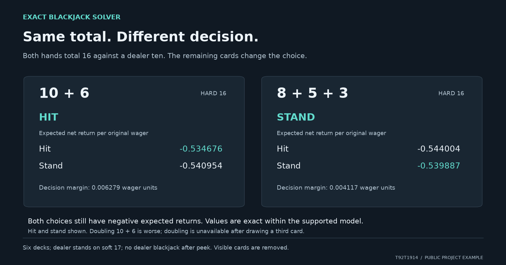

# Read the visual example



Both hands total 16, but the cards remaining in the shoe differ. Under the same six deck rules, the solver recommends hitting 10 + 6 and standing on 8 + 5 + 3. Both decisions still have negative expected returns.

## Reproduce the values

Run from this repository using its documented Python environment.
Evidence was checked against commit `23a42e6`.

```python
from bj.ev import best_action

for cards in [("T", "6"), ("8", "5", "3")]:
    action, values, margin = best_action(cards, "T")
    print(cards, action, values, margin)
```

Both examples use six decks, remove the visible player and dealer cards,
assume the dealer stands on soft 17, and condition on a completed peek with
no dealer blackjack. Surrender is unavailable. The image compares hit and
stand. Doubling 10 + 6 has an expected return of about negative 1.069351
wager units, so it is worse. Doubling is unavailable on the three card hand.

Values are expected net return per original wager, not probabilities of
winning. The displayed margins are small, and neither recommended action
makes the expected return positive. These hit and stand values use exact
enumeration within the supported model. No split approximation is involved
in this example. A three card 16 does not always call for standing; the
particular composition matters.

## Inspect the source

The [underlying values](visual-example-data.json) include the source and
conditions. A [vector copy](blackjack-composition-example.svg) is available for a closer look.
The figure is a visual explanation of the public implementation, not a
screenshot of an external application.
