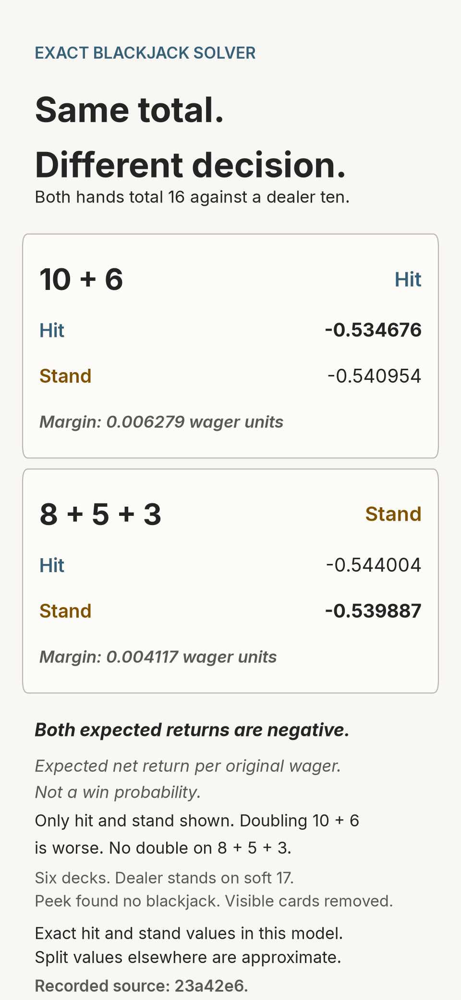

# Read the visual example

<a href="visual-example-data.json">
  <picture>
    <source media="(min-width: 768px) and (prefers-color-scheme: dark)" srcset="blackjack-composition-obscur-wide.png">
    <source media="(min-width: 768px) and (prefers-color-scheme: light)" srcset="blackjack-composition-clair-wide.png">
    <source media="(prefers-color-scheme: dark)" srcset="blackjack-composition-obscur.png">
    <source media="(prefers-color-scheme: light)" srcset="blackjack-composition-clair.png">
    
  </picture>
</a>

Both hands total 16, but the cards remaining in the shoe differ. Under the same six deck rules, the solver recommends hitting 10 + 6 and standing on 8 + 5 + 3. Both decisions still have negative expected returns.

## Reproduce the values

Run from this repository using its documented Python environment.
Evidence was checked against commit `23a42e6`.

```python
from bj.ev import best_action

for cards in [("T", "6"), ("8", "5", "3")]:
    action, values, margin = best_action(cards, "T")
    print(cards, action, values, margin)
```

Both examples use six decks, remove the visible player and dealer cards,
assume the dealer stands on soft 17, and condition on a completed peek with
no dealer blackjack. Surrender is unavailable. The image compares hit and
stand. Doubling 10 + 6 has an expected return of about negative 1.069351
wager units, so it is worse. Doubling is unavailable on the three card hand.

Values are expected net return per original wager, not probabilities of
winning. The displayed margins are small, and neither recommended action
makes the expected return positive. These hit and stand values use exact
enumeration within the supported model. No split approximation is involved
in this example. A three card 16 does not always call for standing; the
particular composition matters.

## Inspect the source

The [underlying values](visual-example-data.json) include the source and
conditions. The [Clair SVG](blackjack-composition-clair.svg) and
[Obscur SVG](blackjack-composition-obscur.svg) carry the same values and outlined
Inter labels. The [original PNG](blackjack-composition-example.png) and
[original SVG](blackjack-composition-example.svg) remain unchanged.
The figure is a visual explanation of the public implementation, not a
screenshot of an external application.

## Rebuild the authored editions

The maintained renderer reads the retained source data. It does not calculate
new action values or rerun the separate joint split study. Supply the six
official static Inter TTFs from one release in a local directory:

```sh
python -m pip install -r requirements-figures.txt
python tools/render_composition_figure.py --font-dir /path/to/Inter/extras/ttf
python tools/render_composition_figure.py --check
```

The renderer checks each font's name, weight, italic flag and Latin glyph
coverage. All six real faces supply labels in the final PNG and SVG editions.
The [rendering record](blackjack-composition-figure.json) records font hashes,
retained values, renderer and token identities, output hashes and layout bounds.
PNG glyphs are rasterized from the supplied files. SVG glyphs are outlined from
the same files, so viewing them does not depend on installed Inter. Selectable
explanations and the original numerical data accompany the images. No font
files are distributed or downloaded.

Hit stays blue and stand amber. The chosen value is bold, with the recommendation
also written explicitly. The two hands keep separate margins and every displayed
value remains negative. GitHub uses light and dark picture sources with a Clair
fallback. The site follows Auto, Clair or Obscur and prints Clair. The compact
portrait layout keeps the values readable in a narrow README. Site builds check
committed input and output identities without fonts or a silent rebuild.

Source `23a42e6` belongs to this retained example, not the later
[joint split reference](joint-split.md). The original image, data and numerical
meaning are preserved.

## Wide and narrow columns

The same renderer also makes a wide composition from the same retained values.
The website chooses its layout from the figure container at 560 pixels and keeps
its existing Auto, Clair and Obscur appearance setting. The README uses a 1024
pixel viewport breakpoint, while these notes use 768 pixels to account for their
wider reading column. These choices follow measurements of the actual GitHub
columns, not an assumption that viewport width equals image width. Signed-out
system appearance is covered. Signed-in appearance overrides remain unverified.

Wide [Clair SVG](blackjack-composition-clair-wide.svg) and [Obscur SVG](blackjack-composition-obscur-wide.svg) preserve the original units, qualifications and Inter outlines. Narrow editions remain available above.
